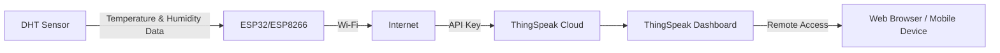

# 🌡️ Remote Temperature and Humidity Monitoring with IoT

This project demonstrates a **practical IoT application** for remote environmental monitoring.  
Using an **ESP32/ESP8266 microcontroller** and a **DHT sensor**, the system collects real-time temperature and humidity data and transmits it to a **cloud platform (ThingSpeak)** for remote visualization and analysis.  

---

## ✨ Features
- **Real-time Data Collection** → Continuously reads temperature and humidity from a DHT sensor.  
- **Wi-Fi Connectivity** → Leverages the ESP32/ESP8266's built-in Wi-Fi.  
- **Cloud Integration** → Sends data securely to [ThingSpeak](https://thingspeak.com/) using API keys.  
- **Remote Visualization** → Monitor current and historical data via a customizable web dashboard.  
- **Modular Design** → Easily adaptable for different sensors (DHT11, DHT22, BME280) and IoT platforms.  

---

## 🧩 Components
- **Microcontroller** → ESP32 or ESP8266  
- **Sensor** → DHT11, DHT22, or BME280  
- **Software** → Arduino IDE  
- **Cloud Platform** → ThingSpeak  

---

## ⚙️ How It Works
1. Connect the **ESP32/ESP8266** to a **DHT sensor**.  
2. The microcontroller connects to a **Wi-Fi network**.  
3. It reads **temperature and humidity values** every few seconds.  
4. Data is sent to **ThingSpeak** using an API key.  
5. ThingSpeak automatically **plots and stores the data** on a dashboard, accessible from any browser.  

---

## 🔄 System Architecture

---

## 📂 Repository Structure
├── code/ # Arduino sketch (.ino) for ESP32/ESP8266
├── docs/ # Wiring diagrams & setup guide
├── resources/ # Project images & ThingSpeak dashboard screenshots
└── README.md # Project documentation

---

## 🚀 Getting Started
### 🔌 Hardware Setup
1. Connect the DHT sensor to the ESP32/ESP8266 (see `/docs/wiring_diagram.png`).  
2. Ensure correct power (3.3V for ESP boards).  

### 💻 Software Setup
1. Install [Arduino IDE](https://www.arduino.cc/en/software).  
2. Add the ESP32/ESP8266 board support in the Arduino IDE.  
3. Install the following libraries:
   - `DHT sensor library`  
   - `Adafruit Unified Sensor`  
   - `WiFi` (for ESP)  

4. Open the `.ino` file from the `/code` folder.  
5. Update your **Wi-Fi SSID**, **Password**, and **ThingSpeak API Key** in the code.  
6. Upload the code to your ESP board.  

### 🌐 Visualization
- Log in to [ThingSpeak](https://thingspeak.com/).  
- Create a channel and copy the **Write API Key**.  
- View **real-time graphs** of temperature and humidity.  

---

## 📸 Project Demo
- 📷 Hardware setup → see `/resources/setup.jpg`  
- 📊 ThingSpeak dashboard → see `/resources/dashboard.png`  

---

## 🎯 Learning Outcomes
By completing this project, you will understand:
- Basics of **IoT system design**.  
- How to use **ESP32/ESP8266** for wireless data transmission.  
- Integration with a **cloud IoT platform (ThingSpeak)**.  
- Creating a **remote monitoring dashboard**.  

---

## 👥 Target Audience
Ideal for **students, makers, and hobbyists** interested in:
- IoT fundamentals  
- Data acquisition and visualization  
- Remote monitoring applications  

---

## 📜 License
This project is licensed under the **MIT License** – see [LICENSE](LICENSE) for details.  

---

